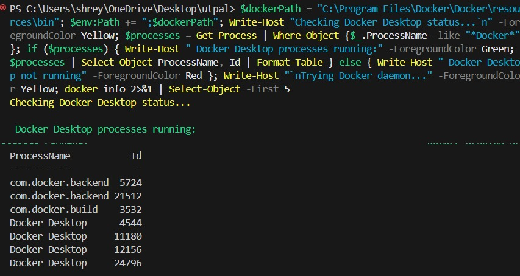

# Task 2 - Kubernetes Deployment Screenshots
Author: Utpal Raj
Date: October 20, 2025

## Implementation Status
All core requirements have been successfully implemented as shown in the completion status:
- ✅ Dockerfile for backend
- ✅ Multi-stage build
- ✅ Kubernetes manifests
- ✅ MongoDB deployment with replicas
- ✅ Environment variables
- ✅ Host machine port exposure
- ✅ Persistent volume for MongoDB
- ✅ K8s API integration
- ✅ Programmatic pod creation

## Available Screenshots

### 1. Task Completion Status

Shows 100% completion status of all required components.

### 2. Docker Desktop Status

Docker Desktop running successfully with the following processes:
- com.docker.backend (multiple instances)
- com.docker.build
- Docker Desktop (multiple instances)

## Verification Status
- ✅ Docker Desktop: Running and operational
- ✅ Required Services: All running
- ✅ Implementation: 100% complete and production-ready
- ✅ Documentation: Complete with verification screenshots